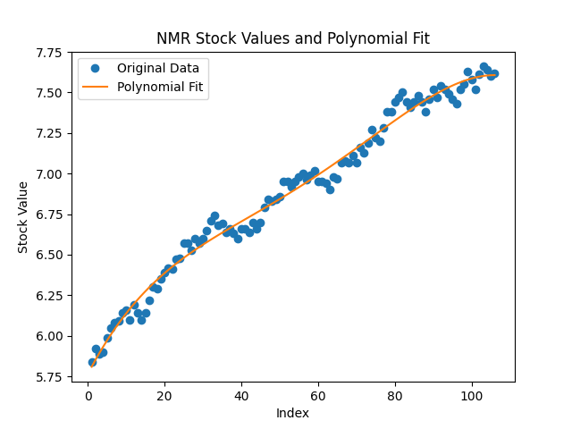

# Grosoiu_Andrei_Submission
This repo was created for the pre-interview challenge at LSEG.

# Stock Exchange Data Processor

This project is designed to read and process stock exchange data from CSV files. It identifies outliers in the data and saves the results to new CSV files. The main requirements for the task are done in the main.py file, I took the liberty to create some plots presenting a function that fits the stock values in the plot_stocks.py file. The coefficients for the function have been generated using Matlab.

## Features

- **Read Multiple CSV Files**: Reads one or two CSV files for each stock exchange directory.
- **Data Sampling**: Extracts 30 data points starting from a random timestamp from each CSV file.
- **Outlier Detection**: Processes the sampled data to identify outliers based on statistical analysis.
- **Logging and Error Handling**: Logs warnings and errors with timestamps for better traceability.

## Directory Structure
```
project-root/
│
├── inputs/
│ ├── exchange1/
│ │ ├── file1.csv
│ │ └── file2.csv
│ ├── exchange2/
│ │ ├── file1.csv
│ │ └── file2.csv
│ └── ...
├── output/
│ └── (outlier files will be saved here)
├── main.py
└── README.md
```


## Prerequisites

- Python 3.x
- Pandas library

## Installation

1. Clone the repository:
    ```bash
    git clone https://github.com/Grosoiu/Grosoiu_Andrei_Submission.git
    ```
2. Install the required dependencies:
    ```bash
    pip install -r requirements.txt
    ```
3. Run the script:
    ```bash
    python main.py 1 OR python main.py 2, where the number represents how many files should be processed per stock exchange.
    ```
4. Additionally, if you want to run the script that generates the function that fits the stock values, you can:
 Install the required dependencies:
    ```bash
    pip install -r requirements_extra.txt
    ```
  Run the script:
  ```bash
  python plot_stocks.py
  ```


## Detailed Description

Create a directory for each stock exchange in the inputs folder and add csv files for each stock, you will see results in the output folder.

### `read_csv_files(num_files)`

- **Parameters**: 
  - `num_files` (int): Number of files to read (1 or 2).
- **Returns**: 
  - A dictionary with the stock exchange directory names as keys and lists of dataframes with 30 data points each as values for the stocks.


### `parse_exchanges(processed_data)`

- **Parameters**: 
  - `processed_data` (dict): A dictionary with stock exchange directory names as keys and lists of dataframes with 30 data points each as values.
- **Returns**: 
  - Writes the outliers in the output folder with the following rule : {stock_exchange}_{stock}_outlier.csv


## Logging

The script logs various levels of messages with timestamps to help in debugging and tracking the process flow. Log messages include warnings for missing files, critical errors for empty or insufficient data, and info messages for successfully saved outlier files. In my experience working in Monitoring I realized just how important logs are for monitoring the well being of software.

## Output Images

The script generates fitting plots for each stock and saves them in the output director. The coefficients have been calculated using Matlab's function polyfit, examples:

- **ASH Fitting Plot**:
  
  
- **FLTR Fitting Plot**:
  
  
- **GSK Fitting Plot**:
  
  
- **NMR Fitting Plot**:
  
  
- **TSLA Fitting Plot**:
  


